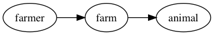

# `graphviz-config-template`
> Templates as visual graph configuration.

## Example

### 

```js
const graphConfig = require('graphviz-config-template')
const createCypherStream = require('cypher-stream')

const { digraph } = graphConfig();

const cypher = createCypherStream('bolt://localhost', 'username', 'password')
const transaction = cypher.transaction()

const farmer = { id: 1, name: 'Old McDonald' }
const farm = { id: 1, name: 'Animal Farm' }
const animal = { id: 1, name: 'Duck' }

transaction.write(
  digraph`farmer -> farm -> animal`({ farmer, farm, animal })
)
transaction.commit()
```

## Install

```sh
yarn add graphviz-config-template
```
